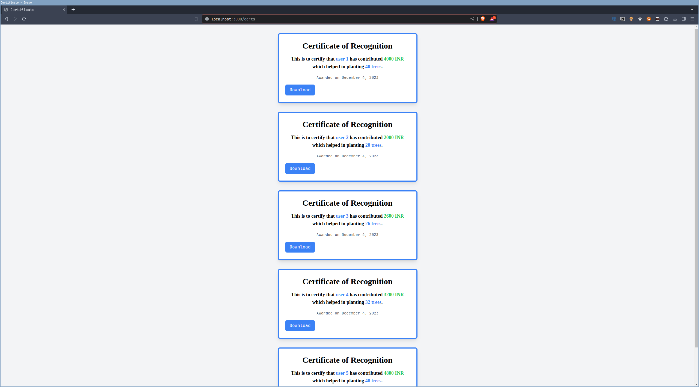

# Excel to JSON

> API implementation to process xlsx data in JSON format and send it in MongoDB

**Schema**

```js
{
  name: String,
  mobile_no: {
    type: String,
    required: true,
    unique: true,
  },
  email: {
    type: String,
    required: true,
    unique: true,
  },
  amount: Number,
  no_of_trees: Number,
}
```

**Page Showcase**

`http://localhost:3000/certs` (browser URL) can be used to access certificates of contributers



**Add Data**

```text
➜ ~ curl -X POST http://localhost:3000/api/send | jq
```

```json
{
  "message": "Data added successfully"
}
```

**Fetch Data**

```text
➜  ~ curl -X GET http://localhost:3000/api/fetch | jq
```

```json
[
  {
    "_id": "656a415585402c8314b00ad3",
    "name": "user 1",
    "mobile_no": "123456789",
    "email": "user1@mail.com",
    "amount": 4000,
    "no_of_trees": 40,
    "__v": 0
  },
  {
    "_id": "656a415585402c8314b00ad4",
    "name": "user 2",
    "mobile_no": "1234567890",
    "email": "user2@mail.com",
    "amount": 2000,
    "no_of_trees": 20,
    "__v": 0
  },
  {
    "_id": "656a415585402c8314b00ad5",
    "name": "user 3",
    "mobile_no": "2345678901",
    "email": "user3@mail.com",
    "amount": 2600,
    "no_of_trees": 26,
    "__v": 0
  },
  {
    "_id": "656a415585402c8314b00ad6",
    "name": "user 4",
    "mobile_no": "3456789012",
    "email": "user4@mail.com",
    "amount": 3200,
    "no_of_trees": 32,
    "__v": 0
  },
  {
    "_id": "656a415585402c8314b00ad7",
    "name": "user 5",
    "mobile_no": "4567890123",
    "email": "user5@mail.com",
    "amount": 4800,
    "no_of_trees": 48,
    "__v": 0
  }
]
```

**Delete Data**

```text
➜  ~ curl -X DELETE http://localhost:3000/api/delete | jq
```

```json
{
  "message": "ALl data deleted successfully",
  "result": {
    "acknowledged": true,
    "deletedCount": 5
  }
}
```
